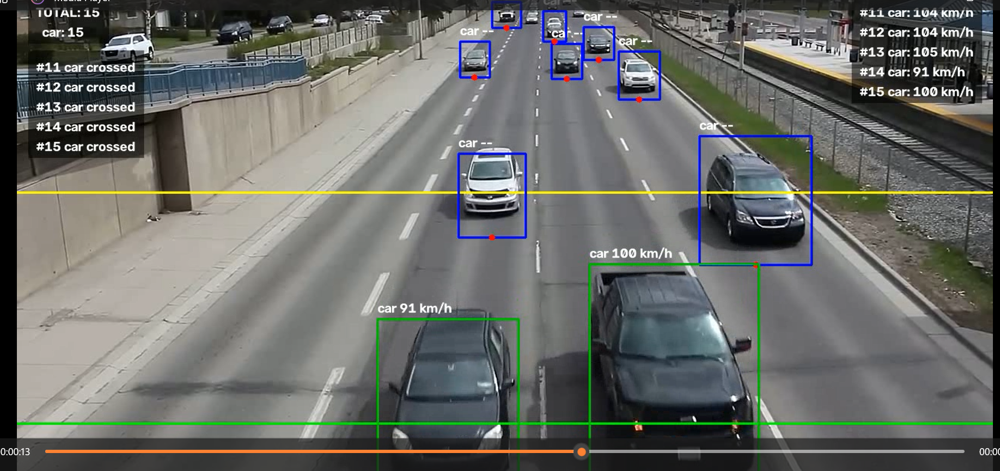
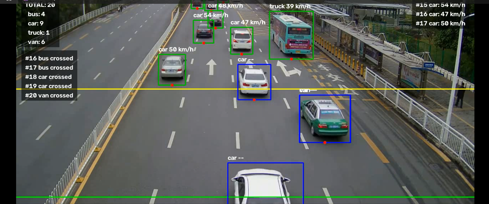

# Vehicle Speed Estimation

YOLOv8-based vehicle detection, tracking, counting, and speed estimation
from a fixed CCTV video using a two-line crossing method.

## Demo

| Highway traffic | City intersection |
|---|---|
|  |  |

## Folder structure

```
vehicle_speed_estimation/
├── data/
│   └── videos/        <- put your input CCTV video(s) here (e.g. your_video.mp4)
├── models/
│   └── best.pt          <- put your trained YOLOv8 weights here
├── outputs/
│   ├── videos/          <- annotated output videos land here
│   └── csv/              <- per-vehicle speed logs (CSV) land here
├── src/
│   └── speed_estimation.py   <- the main script, run this
├── trackers/
│   └── custom_bytetrack.yaml <- tracker config (auto-created on first run)
├── notebooks/
│   └── (optional) experiments.ipynb for quick testing
└── requirements.txt
```

## Setup

```bash
pip install -r requirements.txt
```

## How to run

1. Copy your video into `data/videos/` and your trained weights into `models/`.
2. Open `src/speed_estimation.py` and edit the CONFIG section near the top:
   - `VIDEO_FILENAME` — the filename you placed in `data/videos/`
   - `MODEL_FILENAME` — the filename you placed in `models/` (default `best.pt`)
   - `RUN_NAME` — change this per run so outputs don't overwrite each other
     (e.g. `"run1"`, `"highway_clip"`) — it's used to name both the output
     video and the CSV.
   - `REAL_DISTANCE_METERS` — your estimate of the real road distance between
     the two lines (see the calibration helper printed at the end of a run).
3. Run it:
   ```bash
   python src/speed_estimation.py
   ```
4. Results:
   - Annotated video → `outputs/videos/<RUN_NAME>_annotated.mp4`
   - Speed log → `outputs/csv/<RUN_NAME>_speeds.csv`
     (columns: `vehicle_id, class_name, speed_kmh, video_time_s, logged_at`)

## Notes

- This is a practice/estimation project, not a certified speed-detection
  system — the pixel-to-meter conversion is approximate.
- `vehicle_id` in the CSV is a simple sequential number assigned in the order
  vehicles cross the counting line, not the internal tracker ID.
- If you want a database instead of CSV later (e.g. for a dashboard), swap
  the `csv.writer` call in `speed_estimation.py` for an `sqlite3` INSERT at
  the same point in the code.
